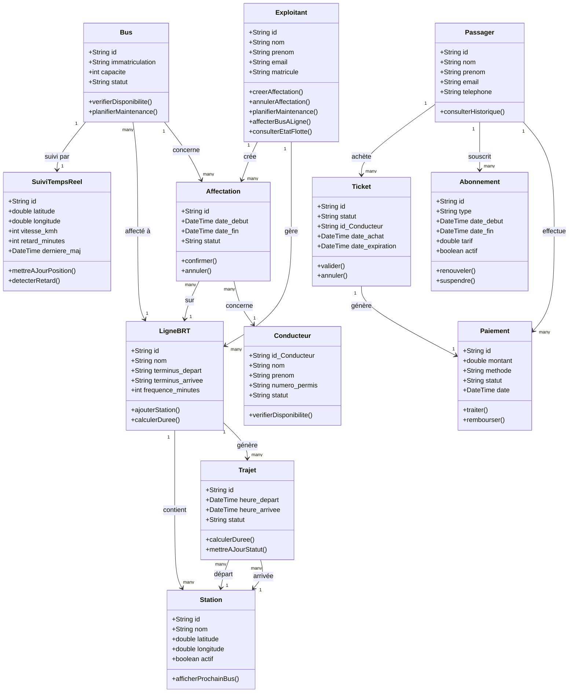

# BRT Senegal : Système de Transport en Commun Rapide

> Plateforme microservices Spring Boot 3.2 / Java 21 pour la gestion du réseau de Bus Rapid Transit.

---

## Sommaire

- [Vue d'ensemble](#-vue-densemble)
- [Architecture](#-architecture)
- [Diagramme de classes](#-diagramme-de-classes)
- [Microservices](#-microservices)
- [Contrats API](#-contrats-api)
- [Événements Kafka](#-événements-kafka)
- [Démarrage rapide](#-démarrage-rapide)
- [Tests](#-tests)
- [Variables d'environnement](#️-variables-denvironnement)
- [Décisions d'architecture](#-décisions-darchitecture)

---

## Vue d'ensemble

Le système BRT Dakar est une architecture microservices complète couvrant :

-  **Billettique & Paiement** — achat de tickets, abonnements, remboursements
-  **Gestion de flotte** — bus, conducteurs, affectations, maintenance
-  **Opérations** — lignes BRT, stations, trajets planifiés
-  **Suivi temps réel** — position GPS, ETA, détection de retards
-  **Passagers** — profils, historique, abonnements
-  **Sécurité** — authentification JWT, autorisation par rôle
-  **Notifications** — SMS/email après chaque événement métier

---

## Architecture

```
Client (mobile / web)
        │
        ▼  :8080
┌────────────────────────────────────────────┐
│                  GATEWAY                   │
│  • Routage dynamique  lb://service (Eureka)│
│  • Rate Limiting (Redis)                   │
│  • Circuit Breaker (Resilience4j)          │
│  • JWT Validation → auth-service           │
│  • Correlation ID + Logging (Zipkin)       │
└───────────────────┬────────────────────────┘
                    │
     ┌──────────────┼──────────────────────┐
     ▼              ▼                      ▼
:8081 security  :8082 passenger      :8083 operation
:8084 fleet     :8085 ticketing      :8086 tracking
:8761 eureka    :8888 config-server
                    │
              ┌─────┼──────┐
              ▼     ▼      ▼
          Postgres Redis  Kafka
```

### Infrastructure

| Composant | Rôle |
|-----------|------|
| **Eureka** | Registre de découverte de services |
| **Config Server** | Configuration centralisée de tous les services |
| **PostgreSQL** | Base de données relationnelle (une DB par service) |
| **Redis** | Rate limiting distribué + cache |
| **Apache Kafka** | Bus d'événements asynchrones |
| **Zipkin** | Distributed tracing |

---

## Diagramme de classes



---

## Microservices

### security-service — port 8081
> Authentification, autorisation JWT, gestion des utilisateurs.

**Responsabilités :** inscription, login, validation de tokens, changement de mot de passe.

**Stack :** Spring Security · JWT · PostgreSQL

---

### passenger-service — port 8082
> Gestion des profils passagers, abonnements et historique de trajets.

**Responsabilités :** CRUD passager, historique de voyages, synchronisation avec ticketing via Kafka.

**Stack :** Spring Data JPA · PostgreSQL · Redis · Kafka

---

### operation-service — port 8083
> Référentiel des lignes BRT, stations et trajets planifiés.

**Responsabilités :** gestion des lignes, stations et trajets ; source de vérité pour tous les autres services.

**Stack :** Spring Data JPA · PostgreSQL

---

### fleet-management-service — port 8084
> Gestion de la flotte de bus, conducteurs et affectations.

**Responsabilités :** CRUD bus/conducteurs, affectation bus-ligne-conducteur, planification de maintenance, publication de l'événement `BusAssignedToLine`.

**Stack :** Spring Data JPA · PostgreSQL · Kafka

---

### ticketing-payment-service — port 8085
> Billettique, paiements et abonnements.

**Responsabilités :** achat et validation de tickets, traitement des paiements (mobile money), souscription/renouvellement d'abonnements.

**Stack :** Spring Data JPA · PostgreSQL · Kafka · Feign (operation, passenger, notification)

---

### realtime-tracking-service — port 8086
> Suivi GPS temps réel des bus et calcul d'ETA.

**Responsabilités :** ingestion des positions GPS, calcul des temps d'arrivée estimés, détection des retards, publication de `BusArrivedAtStation` et `BusDelayDetected`.

**Stack :** Spring Data JPA · PostgreSQL · Kafka · Feign (fleet, operation, notification)

---

### notification-service — port 8087
> Envoi de notifications SMS et email.

**Responsabilités :** écoute des événements Kafka pour envoyer des notifications aux passagers et exploitants à chaque étape clé.

**Stack :** Spring Data JPA · PostgreSQL · Kafka · JavaMailSender

---

### gateway — port 8080
> Point d'entrée unique de toutes les requêtes externes.

**Responsabilités :** routage, rate limiting, validation JWT, circuit breaker, injection de Correlation ID, logging/tracing.

**Stack :** Spring Cloud Gateway · Redis · Resilience4j · Eureka Client

---

### config-server — port 8888
> Centralisation de la configuration de tous les microservices.

Chaque service charge sa configuration depuis `config-server/src/main/resources/configurations/<service>.yml`.

---

### Discovery-service — port 8761
> Registre Eureka pour la découverte de services.

Tous les microservices s'y enregistrent au démarrage. La gateway utilise `lb://nom-service` pour le load balancing dynamique.

---

## Contrats API

### security-service

| Méthode | Endpoint | Description |
|---------|----------|-------------|
| `POST` | `/auth/register` | Inscription d'un utilisateur |
| `POST` | `/auth/login` | Authentification → retourne JWT |
| `POST` | `/auth/validate-token` | Validation de token (appelé par la gateway) |
| `POST` | `/auth/refresh` | Rafraîchissement d'un token expiré |

### passenger-service

| Méthode | Endpoint | Description |
|---------|----------|-------------|
| `POST` | `/passengers` | Créer un compte passager |
| `GET` | `/passengers/{id}` | Récupérer un passager |
| `PUT` | `/passengers/{id}` | Mettre à jour le profil |
| `GET` | `/passengers/{id}/history` | Historique des trajets |
| `GET` | `/passengers/{id}/abonnements` | Abonnements actifs |

### operation-service

| Méthode | Endpoint | Description |
|---------|----------|-------------|
| `GET` | `/lines` | Lister toutes les lignes BRT |
| `GET` | `/lines/{id}` | Détail d'une ligne |
| `GET` | `/lines/{id}/next-bus` | Prochain bus sur une ligne |
| `GET` | `/stations` | Lister toutes les stations actives |
| `GET` | `/stations/{id}` | Détail d'une station + prochain bus |
| `GET` | `/trajets/{id}` | Détail d'un trajet planifié |

### fleet-management-service

| Méthode | Endpoint | Description |
|---------|----------|-------------|
| `GET` | `/fleet/buses` | Lister tous les bus |
| `GET` | `/fleet/buses/{id}` | Détail d'un bus |
| `GET` | `/fleet/conducteurs/{id}` | Infos d'un conducteur |
| `POST` | `/fleet/affectations` | Affecter un bus + conducteur à une ligne |
| `PUT` | `/fleet/affectations/{id}/annuler` | Annuler une affectation |
| `POST` | `/fleet/buses/{id}/maintenance` | Planifier une maintenance |

### ticketing-payment-service

| Méthode | Endpoint | Description |
|---------|----------|-------------|
| `POST` | `/tickets` | Acheter un ticket |
| `POST` | `/tickets/{id}/validate` | Valider un ticket à la station |
| `GET` | `/tickets/{id}` | Détail d'un ticket |
| `GET` | `/tickets?passengerId={id}` | Tickets d'un passager |
| `POST` | `/paiements` | Traiter un paiement |
| `POST` | `/paiements/{id}/rembourser` | Rembourser un paiement |
| `POST` | `/abonnements` | Souscrire à un abonnement |
| `PUT` | `/abonnements/{id}/renouveler` | Renouveler un abonnement |

### realtime-tracking-service

| Méthode | Endpoint | Description |
|---------|----------|-------------|
| `GET` | `/tracking/buses` | Position GPS de tous les bus |
| `GET` | `/tracking/buses/{busId}` | Position, vitesse, retard d'un bus |
| `POST` | `/tracking/buses/{busId}/position` | Mise à jour GPS (appelé par les bus) |
| `GET` | `/tracking/lines/{lineId}/eta` | Temps d'arrivée estimé sur une ligne |

### notification-service

| Méthode | Endpoint | Description |
|---------|----------|-------------|
| `POST` | `/notifications/send` | Envoyer une notification SMS/email |

---

## Événements Kafka

> Les services communiquent de manière asynchrone via des événements — aucun couplage fort entre eux.

| Événement | Émetteur | Consommateurs | Déclencheur |
|-----------|----------|---------------|-------------|
| `UserRegistered` | security-service | passenger-service, notification-service | Inscription réussie |
| `TicketPurchased` | ticketing-payment-service | passenger-service, notification-service | Achat de ticket |
| `TicketValidated` | ticketing-payment-service | passenger-service, operation-service | Validation à la station |
| `PaymentFailed` | ticketing-payment-service | passenger-service, notification-service | Échec de paiement |
| `SubscriptionCreated` | ticketing-payment-service | passenger-service, notification-service | Souscription créée |
| `BusAssignedToLine` | fleet-management-service | realtime-tracking-service | Affectation confirmée |
| `BusArrivedAtStation` | realtime-tracking-service | ticketing-payment-service, notification-service | Arrivée détectée |
| `BusDelayDetected` | realtime-tracking-service | operation-service, notification-service | Retard détecté |

---

## Démarrage rapide

### Prérequis

- Docker & Docker Compose
- Java 21+
- Maven 3.9+

### 1. Lancer l'infrastructure

```bash
git clone https://github.com/Ndiaye-Maimouna/projet_dev_web.git

docker-compose up -d 
```

### 2. Vérifier que tout est prêt

```bash
docker-compose ps
# postgres, kafka et redis doivent afficher "healthy"
```

### 3. Lancer les services (ordre important)

```bash
# 1 — Eureka (service registry)
cd Discovery-service && mvn spring-boot:run &

# 2 — Config Server
cd config-server && mvn spring-boot:run &

# 3 — Security Service
cd security-service && mvn spring-boot:run &

# 4 — Gateway
cd gateway && mvn spring-boot:run &

# 5 — Services métier (dans n'importe quel ordre)
cd operation-service          && mvn spring-boot:run &
cd fleet-management-service   && mvn spring-boot:run &
cd passenger-service          && mvn spring-boot:run &
cd ticketing-payment-service  && mvn spring-boot:run &
cd realtime-tracking-service  && mvn spring-boot:run &
cd notification-service       && mvn spring-boot:run &
```

### Ou tout en une commande Docker

```bash
docker-compose up --build
```

---

### Exemple : créer un passager

Tous les appels passent par le **gateway (port 8080)**.

```http
POST http://localhost:8080/api/v1/passengers
Content-Type: application/json

{
  "firstName": "Fatou",
  "lastName": "Diallo",
  "email": "fatou.diallo@brt.sn",
  "phoneNumber": "+221771234567"
}
```

**Réponse 201 :**
```json
{
  "success": true,
  "message": "Passager créé avec succès",
  "data": {
    "id": "a0000000-0000-0000-0000-000000000001",
    "firstName": "Fatou",
    "lastName": "Diallo",
    "email": "fatou.diallo@brt.sn",
    "phoneNumber": "+221771234567",
    "status": "ACTIVE",
    "hasActiveSubscription": false,
    "createdAt": "2024-04-05T10:00:00Z"
  }
}
```

---

## URLs utiles

| Service | URL |
|---------|-----|
| Gateway | http://localhost:8080 |
| Eureka Dashboard | http://localhost:8761 |
| Config Server | http://localhost:8888 |
| Zipkin Traces | http://localhost:9411 |
| Passenger Actuator | http://localhost:8082/actuator/health |

---

## Tests

```bash
# Lancer les tests d'un service
cd passenger-service
mvn test

# Avec rapport de couverture JaCoCo
mvn test jacoco:report
# Rapport disponible dans target/site/jacoco/index.html

# Tous les services
for svc in passenger-service security-service ticketing-payment-service; do
  echo "=== $svc ===" && cd $svc && mvn test && cd ..
done
```

---

## Variables d'environnement

| Variable | Défaut | Description |
|----------|--------|-------------|
| `SPRING_DATASOURCE_URL` | `jdbc:postgresql://localhost:5432/<service>_db` | URL PostgreSQL |
| `SPRING_KAFKA_BOOTSTRAP_SERVERS` | `localhost:9092` | Kafka brokers |
| `SPRING_REDIS_HOST` | `localhost` | Redis host |
| `EUREKA_CLIENT_SERVICEURL_DEFAULTZONE` | `http://localhost:8761/eureka/` | Eureka registry |
| `SPRING_CONFIG_IMPORT` | `configserver:http://localhost:8888` | Config Server |
| `SPRING_ZIPKIN_BASE_URL` | `http://localhost:9411` | Zipkin tracing |
| `JWT_SECRET` | *(à définir)* | Clé secrète JWT (min. 256 bits) |

---

## Décisions d'architecture

**Pourquoi Spring Cloud Gateway et non Nginx ?**
La gateway s'intègre nativement avec Eureka. Quand un nouveau pod `passenger-service` démarre, elle le détecte automatiquement via `lb://passenger-service` sans aucune configuration manuelle. Elle permet aussi d'écrire des filtres en Java (JWT, Correlation ID, logging) plutôt qu'en Lua comme avec Nginx.

**Pourquoi Eureka (Discovery Service) et non un DNS statique ?**
Dans un environnement conteneurisé, les IPs des services changent à chaque redémarrage. Eureka maintient un registre dynamique : chaque service s'y enregistre au démarrage avec son adresse courante et envoie des heartbeats réguliers. Si un service disparaît, Eureka le retire automatiquement du registre après le délai d'expiration — aucune intervention manuelle nécessaire.

**Pourquoi un Config Server et non des `.env` par service ?**
Toutes les configurations (ports, URLs, secrets, timeouts) sont centralisées en un seul endroit. Un changement de l'URL de Kafka ou d'un secret JWT ne nécessite pas de redéployer tous les services — un simple refresh suffit. Le Config Server lit les fichiers YAML depuis son classpath (ou un repo Git en production), ce qui rend la configuration versionnée et auditable.

**Pourquoi Kafka plutôt que des appels REST synchrones entre services ?**
Le découplage asynchrone évite les dépendances en cascade. Si le `notification-service` est indisponible, le `ticketing-payment-service` continue à fonctionner — la notification sera traitée dès que le service redémarre grâce à la rétention des messages. Kafka garantit aussi l'ordre des messages par partition et offre une durabilité que des appels HTTP ne peuvent pas assurer.

**Pourquoi Resilience4j pour le Circuit Breaker et non Hystrix ?**
Hystrix est en maintenance depuis 2018. Resilience4j est conçu pour Java 8+ avec une API fonctionnelle, une intégration native Spring Boot Actuator pour exposer les métriques de chaque circuit, et un support complet des virtual threads Java 21. Il gère le circuit breaker, le retry, le rate limiter et le bulkhead au sein d'une seule dépendance.

**Pourquoi Redis pour le rate limiting et le cache ?**
La gateway peut tourner en multi-instances. Redis centralise les compteurs de rate limiting pour que la limite soit cohérente quelle que soit l'instance qui reçoit la requête. Le `passenger-service` utilise également Redis comme cache de second niveau pour les profils passagers fréquemment consultés, réduisant la pression sur PostgreSQL.

**Pourquoi PostgreSQL avec une base par service ?**
Principe du *Database per Service* pattern : chaque service est propriétaire de ses données. Aucun service ne peut lire directement la base d'un autre — tout passe par l'API ou les événements Kafka. PostgreSQL est choisi pour sa robustesse transactionnelle, son support natif du JSON (utile pour stocker des métadonnées flexibles) et sa maturité en production.

**Pourquoi Spring Data JPA / Hibernate et non JOOQ ou MyBatis ?**
JPA offre la productivité maximale pour des modèles relationnels classiques avec des entités bien définies. Le dirty checking automatique d'Hibernate simplifie les mises à jour partielles. Pour les requêtes complexes (reporting, agrégations), des requêtes JPQL natives complètent l'approche sans abandonner l'écosystème JPA.

**Pourquoi MapStruct pour le mapping DTO ↔ Entity et non ModelMapper ?**
MapStruct génère le code de mapping à la compilation (pas de réflexion à l'exécution), ce qui le rend plus rapide que ModelMapper et détecte les erreurs de mapping dès le build. Les fichiers `.class` générés dans `target/` en attestent — aucune magie à l'exécution.

**Pourquoi Feign Client pour les appels inter-services synchrones ?**
Quand un appel synchrone est inévitable (ex. : vérifier qu'un passager existe avant d'émettre un ticket), Feign génère le client HTTP à partir d'une interface annotée, s'intègre avec Eureka pour la résolution du service par nom, et avec Resilience4j pour le circuit breaker. Cela évite d'écrire du `RestTemplate` ou `WebClient` boilerplate.

**Pourquoi Zipkin pour le tracing distribué ?**
Dans un appel qui traverse gateway → ticketing → passenger → notification, identifier où la latence se produit est impossible sans tracing. Zipkin corrèle les spans via le `X-Correlation-Id` injecté par la gateway, et offre une UI pour visualiser la chaîne d'appels complète avec les durées de chaque segment.

**Pourquoi Lombok (`@Builder`, `@Data`, `@Slf4j`) ?**
Lombok élimine le boilerplate Java (getters, setters, constructeurs, toString, logger) sans coût à l'exécution — tout est généré à la compilation. Les `*Builder.class` visibles dans `target/` en sont la trace directe. L'utilisation de `@Builder` plutôt que de constructeurs exposés rend la création d'objets plus lisible et résistante aux refactorisations de champs.
---

